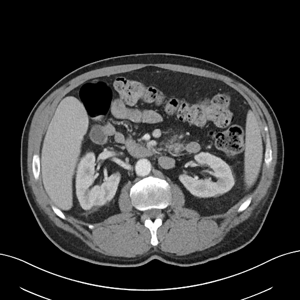

# MedSAM2 for 3D CT

Segment a whole CT volume by prompting **one slice**.

[](https://github.com/rekalantar/MedSAM2-3D-CT/actions/workflows/tests.yml)
[](https://www.python.org)
[](LICENSE)



SAM 2 tracks objects across video frames using memory attention. A CT volume has the same
structure — consecutive slices barely differ — so a single bounding box on one slice can be
propagated through the entire stack. [MedSAM2](https://github.com/bowang-lab/MedSAM2) is
SAM 2.1 fine-tuned so this works on 15-Hounsfield-unit soft tissue contrast rather than
natural-image contrast.

That takes a 94-slice lesion annotation from 94 prompts to one.

---

## 📖 Read the full walkthrough

**[MedSAM2 Tutorial: Segment a 3D CT Scan by Prompting a Single Slice](ARTICLE_URL)**

The article is the detailed version of this repository: what each step does and why, how
memory attention turns a slice stack into a tracking problem, the measured results on two
cases, and the failure mode that took one of them from 0.95 Dice to 0.48.

**What it covers that the code doesn't spell out:**

- Why a CT volume and a video are the same data structure
- What windowing does to the intensity range, and why it mattered less than expected
- What a bounding box actually tells the model — and what it doesn't
- Why propagation has to run in both directions, measured
- Why the prompted slice was not the most accurate slice
- Why one prompt found one lesion out of three, and how the cleanup step made it worse

The [notebook](tutorial/medsam2_3d_ct.ipynb) runs everything end to end. The article
explains it.

---

## Results

Two cases from the MedSAM2 demo set, prompt derived from the ground-truth label:

```
                        slices     Dice   prompted slice
Compact lesion               7    0.952            0.972
Spread across volume        12    0.482                -
```

The second case carries three separate lesions twenty slices apart. One box finds one of
them — the model tracks an object, it does not search for new ones. Detail in the article.

## Install

```bash
pip install git+https://github.com/rekalantar/MedSAM2-3D-CT.git
```

Volume loading needs SimpleITK, kept as an optional extra:

```bash
pip install "medsam2-ct[io] @ git+https://github.com/rekalantar/MedSAM2-3D-CT.git"
```

MedSAM2 itself and its weights are **not** bundled — they carry their own license:

```bash
git clone https://github.com/bowang-lab/MedSAM2.git && cd MedSAM2
pip install -e ".[dev]"
bash download.sh
```

## Use

```python
from medsam2_ct import (build_predictor, dice, largest_component,
                        load_demo_case, save_gif, segment_volume)

case = load_demo_case("000009_03_01_036-048")     # windowed, prompt from the label

predictor = build_predictor()
masks = largest_component(
    segment_volume(predictor, case["volume"], case["box"], case["key"]))

print(dice(case["truth"], masks))                 # 0.952
save_gif(case["volume"], masks, "propagation.gif", rotate=1)
```

Or bring your own scan:

```python
from medsam2_ct import load_volume, segment_volume, window_hu

volume_hu, spacing = load_volume("scan.nii.gz")        # (z, y, x), mm
volume = window_hu(volume_hu, width=400, level=40)     # HU -> uint8
masks = segment_volume(predictor, volume, box=[180, 180, 260, 260], key_slice=47)
```

Box coordinates are in the volume's own pixel space — not resized to the model's input
size, and not rotated for display. The predictor normalises them internally.

## Tutorial notebook

[](https://colab.research.google.com/github/rekalantar/MedSAM2-3D-CT/blob/main/tutorial/medsam2_3d_ct.ipynb)

Runs both cases start to finish on a free T4: loading, windowing, prompting, propagating,
scoring, and the figures. Needs a GPU runtime.

## API

| Function | Does |
|---|---|
| `load_demo_case(case)` | fetch a demo case, window it, derive the prompt |
| `load_volume(path)` | NIfTI/DICOM → array + spacing, both `(z, y, x)` |
| `window_hu(volume, width, level)` | Hounsfield windowing to uint8 |
| `window_preset(volume, preset)` | `abdomen`, `lung`, `brain`, `bone`, `mediastinum` |
| `largest_cross_section(mask)` | index of the clearest slice to prompt |
| `box_from_mask(mask_2d, margin)` | `[x0, y0, x1, y1]` prompt from a mask |
| `resize_grayscale_to_rgb(volume, size)` | (D,H,W) uint8 → (D,3,512,512) for the encoder |
| `preprocess(volume, size, device)` | the above, normalised to a tensor `init_state` accepts |
| `build_predictor(config, checkpoint)` | MedSAM2 video predictor |
| `init_state(predictor, volume)` | preprocess + open an inference state |
| `segment_volume(predictor, volume, box, key_slice)` | one box → 3D mask, both directions |
| `largest_component(mask)` | drop propagation leakage |
| `dice(a, b)` | volumetric overlap |
| `per_slice_dice(truth, pred, key_slice)` | Dice vs distance from the prompt |
| `rotate_clockwise(stack, turns)` | display orientation for axial viewing |
| `overlay_mask(slice, mask)` | RGB overlay |
| `plot_slices(volume, masks, truth, rotate)` | cropped contact sheet with contours |
| `save_gif(volume, masks, path, rotate)` | scrolling animation |

## Two things that silently go wrong

**Preprocessing.** SAM 2's encoder is a natural-image backbone: three channels at 512×512
with ImageNet normalisation, as a float tensor. Handing `init_state` a raw NumPy volume
fails deep inside the predictor with an `AttributeError` about `.to`. `segment_volume` does
this for you; `preprocess` exposes it if you drive the predictor directly.

Note that `video_height`/`video_width` stay the volume's *original* dimensions. Prompts are
therefore given in original pixel coordinates and masks come back at original resolution.

**Spacing axis order.** `load_volume` returns `(z, y, x)`. SimpleITK's `GetSpacing()` returns
`(x, y, z)`. Mix them and every physical distance is wrong on anisotropic scans — no error,
perfectly plausible numbers.

## What this does not solve

- **One prompt, one object.** Multifocal disease needs one prompt per lesion.
- **`largest_component` deletes real findings** when more than one structure is labelled.
- **It still needs a human** to find the lesion and draw the box.
- **Accuracy decays away from the prompt**, which is where a treatment margin is defined.
- **Weights are research and education only.** Not cleared for clinical or commercial use.

## Development

```bash
git clone https://github.com/rekalantar/MedSAM2-3D-CT.git
cd MedSAM2-3D-CT
pip install -e ".[dev,io]"
pytest
```

41 tests. Four check the tutorial notebook statically — that every cell parses, that every
`from medsam2_ct import` resolves, that no name is used before it is bound, and that the
notebook defines no helper functions of its own.

## Reference

Ma, Yang, Kim, Chen, Baharoon, Fallahpour, Asakereh, Lyu & Wang.
[MedSAM2: Segment Anything in 3D Medical Images and Videos](https://arxiv.org/abs/2504.03600), 2025.
Weights: [huggingface.co/wanglab/MedSAM2](https://huggingface.co/wanglab/MedSAM2).
Data: [CT_DeepLesion-MedSAM2](https://huggingface.co/datasets/wanglab/CT_DeepLesion-MedSAM2).

MIT licensed. No model weights or patient data are redistributed here.
